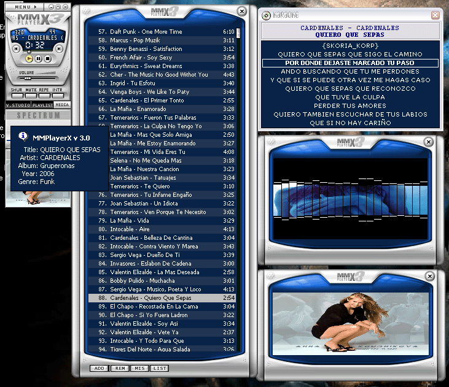



## A\_MMPlayerX 3\.0

### Description

Music Mp3 Player X version 3.0. BETA UPDATED(mar-2007) New release!!!

Full code here.

New Media library and Play list options

Support Skins, Languages, Karaoke function, Tag editor (ID3 v2), Visualization Studio, Spectrum Analyzer, Equalizer 10 bands, Sound Effects,

Covert Front Browser, Mini mode, Play List... and more functions...

visit the web page www.geocities.com/skoria_36

Please Vote!!!!

HECHO EN MEXICO BY RAUL MARTINEZ
 
### More Info
 

             |
---                |---
**Submitted On**   |2007-01-19 12:48:14
**By**             |[R@úL M@RtInEz](https://github.com/Planet-Source-Code/PSCIndex/blob/master/ByAuthor/r-l-m-rtinez.md)
**Level**          |Intermediate
**User Rating**    |4.4 (31 globes from 7 users)
**Compatibility**  |VB 6\.0
**Category**       |[Sound/MP3](https://github.com/Planet-Source-Code/PSCIndex/blob/master/ByCategory/sound-mp3__1-45.md)
**World**          |[Visual Basic](https://github.com/Planet-Source-Code/PSCIndex/blob/master/ByWorld/visual-basic.md)
**Archive File**   |[A\_MMPlayer2054443172007\.zip](https://github.com/Planet-Source-Code/r-l-m-rtinez-a-mmplayerx-3-0__1-68157/archive/master.zip)

